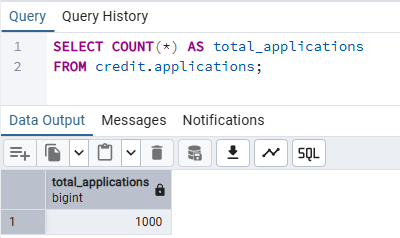
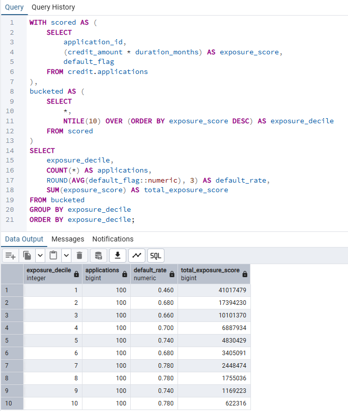

# Credit Risk SQL Analysis

## Project Overview
This project analyses customer credit applications using PostgreSQL to identify high-risk borrower segments and quantify default exposure.

The goal is to simulate a real-world credit risk analysis workflow using structured SQL, staging tables, and advanced analytical techniques.

---

## Objectives
- Calculate overall and segmented default rates  
- Identify high-risk customer groups  
- Analyse exposure-weighted credit risk  
- Perform customer segmentation using SQL  
- Apply CTEs and window functions for advanced analysis  

---

## Project Structure

```
credit-risk-sql-analysis/
│
├── data/
│   └── GermanCredit.csv
│
├── results/
│   ├── exposure_deciles.png
│   └── row_count.png
│
├── sql/
│   ├── 01_schema.sql
│   ├── 02_import.sql
│   └── 03_analysis.sql
│
└── README.md
```

---

## How to run

### 1️⃣ Create the schema and tables:
Run 'sql/01_schema.sql' in pgAdmin connected to 'credit_risk_db'.

### 2️⃣ Importing CSV data:
credit_risk_db -> Schemas -> credit -> applications_raw
Right click `applications_raw` and click `Import/Export Data...`
- Import
- Filename: copy your file path where CSV is stored
- Encoding: UTF8
Go to options:
- Header: on
- Delimiter: ,
- Quote: "
- Escape: "
Click `OK`
Update the file path inside `sql/02_import.sql` to match your local CSV path.
Then execute `02_import.sql`.

This script:
- Loads raw data into `applications_raw`
- Transforms and inserts into `applications`
- Creates a binary `default_flag` variable (1 = default, 0 = non-default)

### 3️⃣ Run analysis:
    Execute `sql/03_analysis.sql` inside pgAdmin Query Tool.

---

## Key SQL Techniques Demonstrated

- Common Table Expressions (CTEs)
- Window Functions (`DENSE_RANK`, `NTILE`)
- Exposure-weighted default rate calculations
- Risk segmentation using `CASE`
- Sample size filtering using `HAVING`
- Aggregations and numeric casting

---

## Example Analytical Questions Answered

- What is the overall default rate?
- Which credit purposes have the highest default probability?
- Which housing types have the highest exposure-weighted risk?
- How does default risk vary by age group?
- What are the top 3 risk drivers within each housing segment?

---

## Tech Stack
- PostgreSQL
- SQL
- pgAdmin

---

## Dataset
[German Credit Dataset – UCI Machine Learning Repository](https://archive.ics.uci.edu/ml/datasets/statlog+(german+credit+data))

---

## Key Findings

- Total applications analysed: 1000
- Overall default rate: 0.700
- Default rates increase significantly across exposure deciles.
- Lowest exposure decile default rate: 0.460
- Highest exposure decile default rate: 0.780
- Higher credit exposure (credit amount × duration) is strongly associated with increased default probability.

These findings demonstrate clear risk segmentation and highlight the importance of exposure-weighted analysis in credit risk assessment.

---

## Results & Validation

### 1️⃣ Dataset Successfully Loaded

The dataset was successfully imported into PostgreSQL.



This confirms that 1000 applications were loaded into the analysis table.

---

### 2️⃣ Exposure Decile Risk Segmentation

Applications were segmented into exposure deciles using a window function (`NTILE`).



Default rates increase from 0.460 in the lowest exposure decile to 0.780 in the highest exposure decile, demonstrating a clear risk gradient.